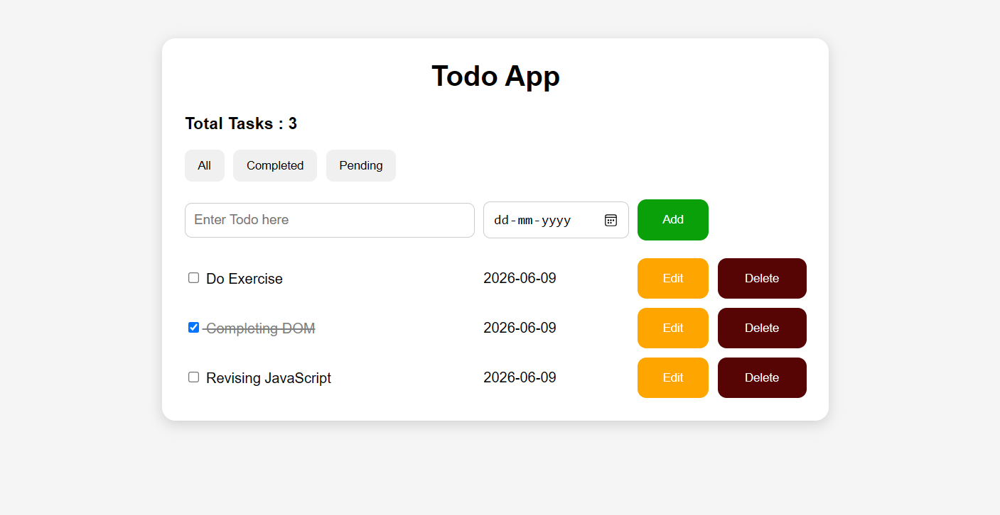

# 📝 Todo App

A responsive Todo App built using HTML, CSS, and JavaScript.

## 🚀 Features

- Add Tasks
- Edit Tasks
- Delete Tasks
- Mark Tasks as Completed
- Task Counter
- Filter Tasks (All / Completed / Pending)
- Local Storage Support
- Responsive Design
- Enter Key Support
- Input Validation

## 🛠️ Technologies Used

- HTML5
- CSS3
- JavaScript (ES6)

## 📂 Project Structure

```text
Todo App/
│
├── todo.html
├── todo.css
├── todo.js
└── README.md
```

## 📸 Screenshot



## 🎯 Learning Outcomes

This project helped me learn:

- DOM Manipulation
- Event Handling
- Local Storage
- JavaScript Objects & Arrays
- Responsive Web Design
- Git & GitHub

## 👩‍💻 Author

Pragati Parmar

GitHub: https://github.com/pragati-003
